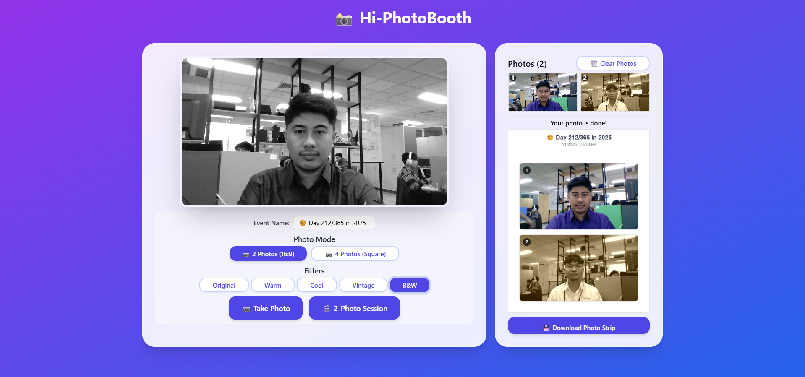

# 📸 Hi-PhotoBooth

A modern, interactive photobooth application built with Next.js, featuring real-time camera capture, multiple photo modes, filters, and automatic collage generation.



## ✨ Features

### 🎯 **Core Functionality**
- **Dual Photo Modes**: Switch between 2-photo (16:9 landscape) and 4-photo (square) modes
- **Real-time Camera**: Live camera preview with mirror effect
- **Smart Cropping**: Intelligent aspect ratio handling for different photo modes
- **Auto Collage**: Automatic photo strip generation with custom layouts

### 🎨 **Visual Effects**
- **5 Built-in Filters**: Original, Warm, Cool, Vintage, Black & White
- **Live Filter Preview**: See effects in real-time before capturing
- **Countdown Timer**: 3-second countdown for photo capture
- **Session Mode**: Automated multi-photo sessions with intervals

### 🎪 **User Experience**
- **Dynamic Event Naming**: Auto-generated event names with current date
- **Responsive Design**: Works on desktop and mobile devices
- **Clean Interface**: Modern UI with Tailwind CSS
- **Download Ready**: One-click download of photo strips

## 🚀 Getting Started

### Prerequisites
- Node.js 16.x or later
- A modern web browser with camera support
- Camera/webcam access permissions

### Installation

1. **Clone the repository**
   ```bash
   git clone https://github.com/Hi-Day/photobooth.git
   cd photobooth
   ```

2. **Install dependencies**
   ```bash
   npm install
   ```

3. **Run the development server**
   ```bash
   npm run dev
   ```

4. **Open your browser**
   Navigate to [http://localhost:3000](http://localhost:3000)

## 🎮 How to Use

1. **Allow camera access** when prompted by your browser
2. **Choose photo mode**: 2-photo (landscape) or 4-photo (square)
3. **Select a filter** from the available options
4. **Customize event name** (optional)
5. **Take photos**:
   - Single photo: Click "📷 Take Photo"
   - Session mode: Click "🎬 X-Photo Session" for automated capture
6. **Download your photo strip** once all photos are captured

## 🛠️ Technical Details

### Tech Stack
- **Frontend**: Next.js 13.x, React 18.x
- **Styling**: Tailwind CSS 3.x
- **Camera API**: MediaDevices getUserMedia()
- **Image Processing**: HTML5 Canvas API
- **Build Tool**: Next.js built-in bundler

### Browser Support
- Chrome 60+
- Firefox 55+
- Safari 11+
- Edge 79+

## 🚀 Deployment

### Vercel (Recommended)
1. Connect your GitHub repository to Vercel
2. Deploy automatically on every push to main
3. Custom domain setup available

### Manual Deployment
```bash
npm run build
npm start
```

## 🤝 Contributing

1. Fork the repository
2. Create your feature branch (`git checkout -b feature/amazing-feature`)
3. Commit your changes (`git commit -m 'Add amazing feature'`)
4. Push to the branch (`git push origin feature/amazing-feature`)
5. Open a Pull Request

---

**Made with ❤️ by Hi-Day Team**

*Transform any space into a fun photobooth experience!* 📸✨
